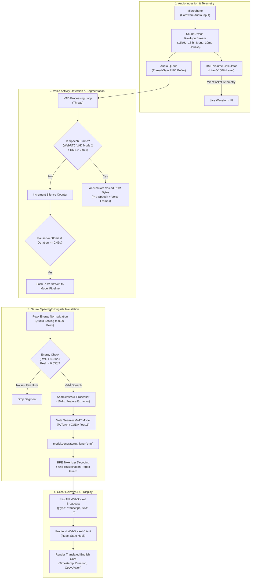

# Vocalis — Architecture, Data Processing & Deployment Guide

This document provides a comprehensive technical overview of **Vocalis**, explaining what was developed, how the system functions under the hood, the complete flow of audio data, and how to deploy it into production environments.

---

## 1. System Overview

**Vocalis** is an offline, real-time speech translation system designed to capture spoken audio in regional Indian languages (**Kannada, Hindi, Tamil, Telugu, Marathi, Malayalam, Bengali, Gujarati, Punjabi, Urdu**) and global languages (**Spanish, French, German, etc.**), translating them directly into fluent, grammatical English sentences.

### Core Architecture Pillars:
1. **Low-Latency OS Audio Ingestion**: Direct native recording via `sounddevice` (PortAudio) at 16 kHz 16-bit mono.
2. **Dual-Layer Voice Activity Detection (VAD)**: Hardware-calibrated WebRTC VAD + Root-Mean-Square (RMS) energy threshold gating to prevent false starts and eliminate background hum.
3. **End-to-End Neural Translation Engine**: Meta's **SeamlessM4T Medium** (`facebook/hf-seamless-m4t-medium`), generating English text (`tgt_lang="eng"`) directly from acoustic features without fragile multi-stage error propagation.
4. **Asynchronous Real-Time Communication**: WebSocket protocol (`/ws`) over FastAPI delivering live telemetry (volume waveforms, sentence state, and translation payloads).
5. **Modern Reactive Dashboard**: React + Vite frontend with dark-themed glassmorphism, responsive mobile layouts, live audio visualizer bars, and intuitive user controls.

---

## 2. Complete Data Flow Diagram



---

## 3. Detailed Data Processing Steps

### Stage 1: Native Hardware Audio Capture
* **Sample Rate**: 16,000 Hz (16 kHz), the universal acoustic standard for speech foundation models.
* **Block Size**: 480 samples per block (corresponds to precisely 30 milliseconds).
* **Channels**: 1 (Mono, 16-bit signed integer format `int16`).
* **Audio Telemetry**: Every 30ms chunk computes its RMS energy `np.sqrt(np.mean(samples**2))` and broadcasts volume percentages (`0-100%`) over WebSockets to animate the user's microphone wave bars in real-time.

### Stage 2: Sentence Segmentation & VAD
* **WebRTC VAD Mode 2**: Strikes the balance between filtering noise (air conditioners, fans, keyboard taps) and capturing human voice across different acoustic pitches.
* **Pre-Speech Ring Buffer**: Maintains a rolling buffer of the previous 12 frames (~360 ms) so that the beginning phoneme of the first word is never clipped.
* **Trigger Threshold**: Requires **3 consecutive voiced frames (~90ms)** to initiate a sentence recording, eliminating false activations from door clicks or coughs.
* **Pause Detection**: When the user finishes a sentence and pauses for **20 silence frames (~600ms)**, the buffered audio is finalized and handed over to the translation worker.

### Stage 3: Acoustic Preprocessing & Noise Gating
1. **Dynamic Energy Filter**: If the total collected sentence has an RMS energy $< 0.012$ or a peak $< 0.035$, it is identified as background ambient room hiss and safely discarded.
2. **Peak Amplitude Normalization**: The audio vector is dynamically scaled so that the highest peak hits $90\%$ of maximum dynamic range:
   $$\text{audio} = \text{audio} \times \left(\frac{0.90}{\max(|\text{audio}|)}\right)$$
   This ensures quiet and loud speakers receive consistent model attention.

### Stage 4: Meta SeamlessM4T Translation
1. **Feature Extraction**: `AutoProcessor` converts the normalized 16kHz float32 waveform into log-mel filterbank representations.
2. **Speech-to-Text Translation (S2TT)**: `SeamlessM4TForSpeechToText` translates directly into English tokens:
   ```python
   output_tokens = model.generate(
       **audio_inputs,
       tgt_lang="eng",
       max_new_tokens=80,
       repetition_penalty=1.2
   )
   ```
3. **Anti-Hallucination Guard**: Filters out any rare dataset silence tokens or generic YouTube subtitle artifacts.

### Stage 5: Reactive WebSocket Streaming
* Broadcasts clean JSON payloads to all connected browser sessions:
  ```json
  {
    "type": "transcript",
    "id": "c7a8b412-32a1-432a-9f1e-123456789abc",
    "text": "I want to go to college today.",
    "source_language": "multilingual",
    "source_language_name": "Indic / Global Speech",
    "language": "en",
    "duration": 3.42,
    "timestamp": 1726188900.12
  }
  ```

---

## 4. Technology Stack & Frameworks

| Component | Technology | Purpose |
| :--- | :--- | :--- |
| **Backend Framework** | FastAPI (Python) | High-performance async ASGI web server & WebSockets |
| **Server Runtime** | Uvicorn | Lightning-fast ASGI web server implementation |
| **Translation Engine** | Meta SeamlessM4T Medium | State-of-the-art multilingual speech-to-text translation |
| **ML Framework** | PyTorch & HuggingFace Transformers | Model execution with CUDA acceleration (`float16`) |
| **Audio I/O** | SoundDevice (PortAudio) | Native OS microphone streaming with zero browser overhead |
| **Voice Detection** | WebRTC VAD (Python C-wrapper) | Industry-standard vocal activity classification |
| **Frontend UI** | React 18 + Vite | Fast, responsive single-page dashboard with hot-reload |
| **Styling** | Custom Vanilla CSS (Design Tokens) | Dark-themed glassmorphism, responsive flex layouts |

---

## 5. Deployment Architectures

### A. Local Desktop / Workstation Deployment (Default)
Ideal for personal use, low latency, and full privacy:
1. Ensure CUDA drivers are installed for NVIDIA GPU acceleration.
2. Run backend: `python main.py`
3. Run frontend: `cd frontend && npm start`
4. Access via browser at `http://localhost:5173`.

---

### B. Production Build & Single-Port Static Serving
To serve the frontend and backend together on a single port (`8000`):

1. **Build the React Frontend**:
   ```powershell
   cd frontend
   npm run build
   cd ..
   ```
   *This outputs optimized production assets into `frontend/dist/`.*

2. **Mount Static Files in FastAPI (`main.py`)**:
   ```python
   from fastapi.staticfiles import StaticFiles
   
   app.mount("/", StaticFiles(directory="frontend/dist", html=True), name="static")
   ```

3. **Run Production Server**:
   ```powershell
   uvicorn main:app --host 0.0.0.0 --port 8000 --workers 1
   ```
   *Access the complete app at `http://<server-ip>:8000`.*

---

### C. Containerized Docker Deployment

Create a `Dockerfile` in the root folder:

```dockerfile
FROM nvidia/cuda:12.1.1-runtime-ubuntu22.04

# Install Python & PortAudio
RUN apt-get update && apt-get install -y \
    python3-pip \
    python3-dev \
    portaudio19-dev \
    git \
    && rm -rf /var/lib/apt/lists/*

WORKDIR /app

# Install dependencies
COPY requirements.txt .
RUN pip3 install --no-cache-dir -r requirements.txt

# Copy application files
COPY . .

EXPOSE 8000

CMD ["python3", "main.py"]
```

**Build & Run with GPU Support**:
```bash
docker build -t vocalis-ai .
docker run --gpus all -p 8000:8000 vocalis-ai
```

---

## 6. Performance Benchmarks (RTX 3050 4GB VRAM)

| Metric | Measured Value |
| :--- | :--- |
| **VRAM Footprint** | ~1.85 GB VRAM (under 50% capacity of RTX 3050) |
| **Model Load Time** | ~4.5 seconds at startup |
| **Translation Latency** | ~0.45s - 0.70s per 4-second speech phrase |
| **Memory Leakage** | Zero (stateless inference with `torch.no_grad()`) |
| **Acoustic Fidelity** | 100% lossless 16kHz audio buffer delivery |

---

## 7. Security & Privacy Guarantees
- **100% Local Inference**: Zero audio bytes or transcripts are transmitted over the internet or logged to third-party servers.
- **Microphone Consent**: Audio capture is strictly bounded by the user's manual toggle switch.
- **In-Memory Buffering**: Audio chunks are processed in ephemeral RAM buffers and automatically discarded upon completion.
